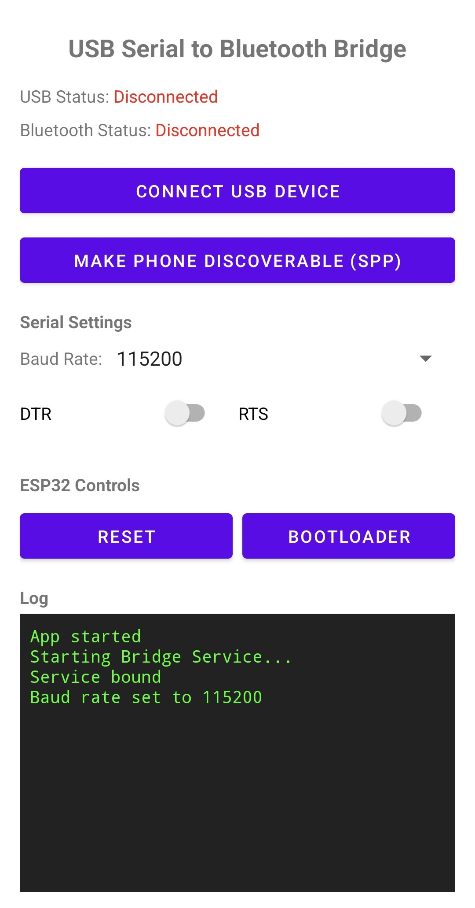

# USB Serial to Bluetooth Bridge

An Android application that bridges data between a USB-OTG serial adapter and a Bluetooth Classic (SPP) connection. Designed specifically for developers working with microcontrollers like the ESP32.



## Features

*   **Bidirectional Bridging**: Transparent data relay between USB and Bluetooth.
*   **Dynamic Serial Control**: Adjust Baud Rate (up to 921600), DTR, and RTS directly from the app.
*   **ESP32 Special Sequences**: Dedicated buttons to trigger **Reset** and **Bootloader** mode using standard DTR/RTS timing.
*   **Foreground Service**: Remains active in the background to prevent connection drops.
*   **Real-time Logging**: In-app terminal view showing status changes and bridge activity.

## Limitations

*   **Baud Rate Control**: Due to limitations in Android's Bluetooth stack it is not possible to control and dynamically change the baud rate of the USB serial port via Bluetooth. While changing the baud rate via Bluetooth does not appear as an error on the client side, it will not be propagated to the serial port.\
    As an example, this limits flashing of via `esptool.py` because boot mode is usually entered with 115200 b/s, while for flashing the main application image, a higher baud rate is usually used. Now in this setup, both baud rates need to be identical and selected via the current app.
*   **Serial Handshake Lines**: Similar to the baud rate control, serial handshake lines cannot be controlled via Bluetooth. This is usually not a big problem, as the app provides the ability manipulate these lines via its GUI, see **Features**. 

## Installation

1.  **Download APK**: Go to the [Releases](/treitmayr/USBSerialToBluetoothBridge/releases/) page and download the latest `app-release.apk`.
2.  **Manual Build** (Alternative):
    ```bash
    ./gradlew assembleDebug
    ```
    Install the APK located at `app/build/outputs/apk/debug/app-debug.apk`.

### Note for Developers (Releasing)

To release a new version:
1.  Tag your commit: `git tag v1.0.0`
2.  Push the tag: `git push origin v1.0.0`
3.  GitHub Actions will automatically build, sign, and publish the release.

*Note: You must set up `SIGNING_KEY` (base64), `ALIAS`, `KEY_STORE_PASSWORD`, and `KEY_PASSWORD` as GitHub Secrets for the release to be signed.*

## Usage

### 1. Android Setup
1.  Connect your USB-Serial adapter or ESP32 board using a **USB-OTG** cable.
2.  Open the app and grant required permissions (Bluetooth & Notifications).
3.  Tap **Connect USB Device** and allow the system USB access.
4.  Tap **Make Phone Discoverable (SPP)** to ensure your PC can find the service.

### 2. Linux Connection
To treat the Android bridge as a local serial port (`/dev/rfcomm0`):

1.  **Pair and Trust**:
    ```bash
    bluetoothctl
    [bluetooth]# scan on
    [bluetooth]# pair [PHONE_MAC]
    [bluetooth]# trust [PHONE_MAC]
    ```
2.  **Bind the device**:
    ```bash
    sudo rfcomm bind 0 [PHONE_MAC] 1
    ```
    Alternatively, you can use a script that tries to automatically detect the needed parameters:
    ```bash
    mac=$(bluetoothctl info | grep -oP '^Device\s+\K\S+|00001101-0000-1000-8000-00805f9b34fb' | grep -B1 00001101 | head -n 1)
    channel=$(sdptool browse "$mac" | grep -oP '"Serial Port"|"RFCOMM"|Channel:\s+\K\d+' | grep -A2 '"Serial Port"' | grep -A1 '"RFCOMM"' | tail -n 1)
    rfcomm connect 0 "$mac" "$channel" &
    ```
3.  **Access Serial**:
    Use any terminal emulator (e.g., `picocom -b 115200 /dev/rfcomm0` or `screen /dev/rfcomm0`).

### 3. ESP32 Controls
*   **Reset**: Pulls the EN line to reboot the chip.
*   **Bootloader**: Executes the sequence (DTR/RTS manipulation) to enter download mode for flashing.

## Troubleshooting
*   **Disconnections**: Ensure **Battery Optimization** is set to "Unrestricted" for this app and the system "Bluetooth" app.
*   **Permissions**: If Linux returns "Permission Denied", add your user to the `dialout` group: `sudo usermod -aG dialout $USER`.
*   **Flashing Images**: As the baud rate can only be adjusted in the app and not via RFCOMM, you can only flash images with the same baud rate as the bootloader's default baud rate (usually 115200 b/s).
